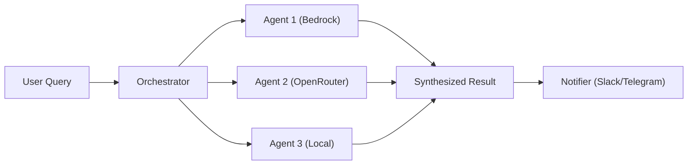

# 🪐 OrbitAgents

[](https://opensource.org/licenses/MIT)
[](https://www.python.org/downloads/)
[](CONTRIBUTING.md)

**OrbitAgents** is a flexible, open-source framework for orchestrating multiple AI agents. It empowers developers to build complex, multi-agent systems where each agent can utilize different LLM providers (Bedrock, OpenRouter, etc.) and specialized tools (MCP) to solve intricate tasks collaboratively.

Use it alongside the companion HTTP MCP server [OrbitRemoteMCP](https://github.com/RezaImany/OrbitRemoteMCP) when you need authenticated, rate-limited, streamable MCP tools over HTTP.

## 🚀 Why OrbitAgents?

- **🧩 Agnostic & Pluggable**: Mix and match LLM providers (AWS Bedrock, OpenRouter, OpenAI) and notification channels (Slack, Telegram, Console).
- **🛠️ MCP Native**: First-class support for the Model Context Protocol (MCP) to give your agents superpowers.
- **🤖 Specialized Agents**: Create agents with distinct personalities, tools, and underlying models.
- **⚡ Viral-Ready**: Designed for speed, scalability, and ease of contribution.

## 🧭 Use cases & examples


| Scenario             | What it shows                                          | Where to start                              |
| -------------------- | ------------------------------------------------------ | ------------------------------------------- |
| Monitoring Assistant | Multi-agent monitoring with MCP tools and Slack alerts | use-cases/monitoring-assistant/README.md    |
| Simple orchestrator  | Minimal orchestration with default providers           | examples/simple_orchestrator.py             |
| Mixed providers      | Bedrock + OpenRouter in one run                        | examples/mixed_providers.py                 |
| Build your own       | Steps to scaffold a new use case                       | use-cases/README.md                         |
| Remote MCP tools     | Consume an HTTP MCP server with auth + streaming       | https://github.com/RezaImany/OrbitRemoteMCP |

## 🏗️ Architecture



## ⚡ Quick Start

### 1. Install Dependencies

```bash
pip install -r requirements.txt
```

### 2. Configure Environment

```bash
cp .env.example .env
# Edit .env with your API keys and notifier settings
# Point MCP_SERVER_URL/MCP_API_KEY at your MCP server (OrbitRemoteMCP is a good default)
```

### 3. Run It

```bash
python main.py
```

## 🛠️ How to Build a Use Case

OrbitAgents is designed to be the backbone of your AI applications. Here is how you can build your own use case:

### 1. Create a Directory

Create a new directory for your project (e.g., `my_agent_app`).

### 2. Initialize Components

Import the necessary factories and helpers:

```python
from providers.factory import create_llm_provider
from notifiers.factory import create_notifier
from helpers.agent_tools import AgentToolRegistry, EnhancedOrchestrator
from helpers.mcp_client import MCPClient

# Initialize core components
llm_provider = create_llm_provider()
notifier, channel = create_notifier()
mcp_client = MCPClient(...)  # Point this at OrbitRemoteMCP or any MCP server
```

### 3. Register Agents

Define your specialized agents. Each agent can have its own personality and tools.

```python
agent_registry = AgentToolRegistry(
    default_llm_provider=llm_provider,
    default_mcp_client=mcp_client
)

agent_registry.register_agent(
    name="analyst",
    description="Analyzes data and trends",
    system_prompt="You are an expert analyst..."
)
```

### 4. Create Orchestrator

The orchestrator manages the agents and handles the flow of information.

```python
orchestrator = EnhancedOrchestrator(
    llm_provider=llm_provider,
    mcp_client=mcp_client,
    agent_registry=agent_registry,
    notifier=notifier
)

# Run a query
response = orchestrator.ask("Analyze the Q3 sales data", channel=channel)
```

For a real-world example, check out the **Monitoring Assistant** use case in the `use-cases/` directory or the `examples/` folder.

## 📖 Documentation

- [**Quick Start Guide**](QUICKSTART.md): Get up and running in minutes.
- [**Architecture**](ARCHITECTURE.md): Deep dive into the factory pattern and core components.
- [**Use Cases**](use-cases/README.md): Real-world scenarios built on OrbitAgents.
- [**OrbitRemoteMCP (companion MCP server)**](https://github.com/RezaImany/OrbitRemoteMCP): Host MCP tools with auth, rate limiting, and streaming HTTP.
- [**Contributing**](CONTRIBUTING.md): Join the community and help us build OrbitAgents.
- [**Security**](SECURITY.md): Best practices for keeping your agents secure.

## 🌟 Community & Support

OrbitAgents is an open-source project, and we welcome contributions from the community!

- **🐛 Issues**: Report bugs or request features on [GitHub Issues](https://github.com/rezallion/OrbitAgents/issues).
- **💬 Discussions**: Join the conversation (Coming Soon).
- **🗺️ Roadmap**: Check out what we're building next.

## 🤝 Contributing

We love contributors! Please read our [Contributing Guide](CONTRIBUTING.md) to get started.

## 📄 License

This project is licensed under the MIT License - see the [LICENSE](LICENSE) file for details.

---

<p align="center">
  Built with ❤️ by the OrbitAgents Contributors
</p>
