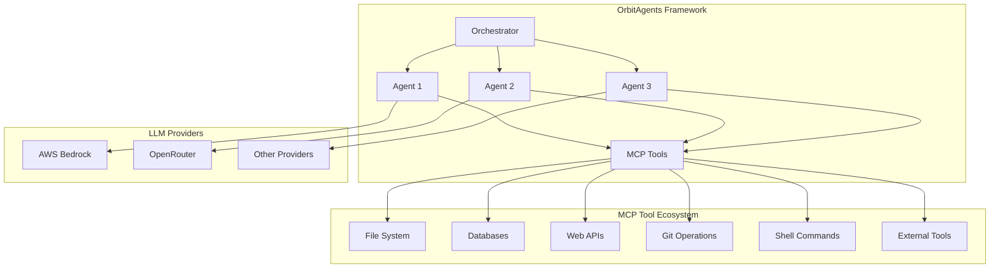

# OrbitAgents Use Cases Ideas

## Overview

OrbitAgents is a flexible, open-source framework for orchestrating multiple AI agents with native Model Context Protocol (MCP) support. This document outlines comprehensive use cases demonstrating the framework's capabilities across various domains, leveraging MCP tools for external integrations and data access.

## Architecture Overview

## Existing Use Cases

### 1. Simple Agent Orchestration
**Description**: Basic multi-agent collaboration for task decomposition and synthesis.

**Agents**:
- Analyst: Data analysis and pattern identification
- Researcher: Information gathering and synthesis
- Validator: Accuracy verification and quality assurance

**MCP Integration**: File system access, web APIs for data retrieval

**Key Features**:
- Task delegation based on agent specialization
- Result synthesis and validation
- Notification channel integration

### 2. Mixed LLM Provider Orchestration
**Description**: Leveraging different LLM providers for specialized agent capabilities.

**Agents**:
- Bedrock Analyst: AWS-powered data analysis
- OpenRouter Researcher: Multi-model research capabilities
- Default Validator: Fallback validation using primary provider

**MCP Integration**: Provider-specific API optimizations

**Key Features**:
- Provider selection based on task requirements
- Cost optimization through provider mixing
- Performance benchmarking across models

## Advanced Use Cases

### 3. DevOps/SRE Monitoring System
**Description**: Comprehensive infrastructure monitoring and incident response automation.

**Agents**:
- Infrastructure Monitor: System health tracking
- Log Analyzer: Error pattern detection and correlation
- Incident Responder: Automated remediation actions
- Capacity Planner: Resource optimization recommendations

**MCP Tools**:
- System metrics APIs (Prometheus, CloudWatch)
- Log aggregation systems (ELK stack)
- Configuration management databases
- Notification and alerting APIs

**Workflow**:
1. Continuous metric collection and analysis
2. Anomaly detection using machine learning
3. Automated incident triage and initial response
4. Capacity planning and resource optimization

**Business Value**:
- 24/7 infrastructure monitoring
- Reduced mean time to resolution (MTTR)
- Proactive capacity management
- Cost optimization through intelligent scaling

### 4. AI-Powered Code Review Pipeline
**Description**: Automated code quality assurance and development workflow optimization.

**Agents**:
- Code Analyzer: Static analysis and best practice checking
- Security Scanner: Vulnerability detection and remediation
- Performance Reviewer: Bottleneck identification and optimization
- Documentation Specialist: API documentation generation

**MCP Tools**:
- Git repository access and operations
- Code analysis tools (ESLint, SonarQube)
- Security scanning APIs (OWASP, Snyk)
- Documentation generation tools (Swagger, JSDoc)

**Workflow**:
1. Pre-commit code analysis
2. Automated security vulnerability scanning
3. Performance regression detection
4. Documentation completeness verification

**Business Value**:
- Consistent code quality standards
- Early vulnerability detection
- Accelerated development cycles
- Reduced technical debt accumulation

### 5. Financial Analysis & Trading Assistant
**Description**: Real-time market analysis and automated trading strategy execution.

**Agents**:
- Market Analyst: Technical and fundamental analysis
- Risk Assessor: Portfolio risk evaluation
- Portfolio Optimizer: Asset allocation optimization
- News Sentiment Analyzer: Market sentiment tracking

**MCP Tools**:
- Financial data APIs (Bloomberg, Alpha Vantage)
- Trading platform integrations
- News aggregation APIs
- Historical market data databases

**Workflow**:
1. Multi-source market data aggregation
2. Real-time sentiment analysis
3. Risk-adjusted portfolio optimization
4. Automated trade execution with compliance checks

**Business Value**:
- Enhanced decision-making speed
- Reduced human error in trading
- Comprehensive risk management
- Regulatory compliance automation

### 6. Content Creation & Marketing Automation
**Description**: Multi-channel content strategy and automated marketing execution.

**Agents**:
- Content Strategist: Audience analysis and content planning
- SEO Optimizer: Search engine optimization
- Social Media Manager: Multi-platform content distribution
- Analytics Reporter: Performance measurement and insights

**MCP Tools**:
- Content management systems (CMS)
- Social media APIs (Twitter, LinkedIn, Facebook)
- SEO analysis tools (Ahrefs, SEMrush)
- Analytics platforms (Google Analytics)

**Workflow**:
1. Audience segmentation and content personalization
2. SEO-optimized content generation
3. Multi-platform automated posting
4. Performance analytics and optimization

**Business Value**:
- Consistent brand voice across channels
- Improved content engagement metrics
- Time-to-market acceleration
- Data-driven marketing optimization

### 7. Customer Support Automation
**Description**: Intelligent customer service with automated ticket resolution.

**Agents**:
- Ticket Classifier: Automatic categorization and prioritization
- Knowledge Base Searcher: Relevant documentation retrieval
- Response Generator: Personalized response creation
- Escalation Handler: Complex issue routing

**MCP Tools**:
- CRM system integrations (Salesforce, Zendesk)
- Knowledge base databases
- Email and chat platform APIs
- Sentiment analysis tools

**Workflow**:
1. Intelligent ticket routing based on content analysis
2. Automated response generation with personalization
3. Proactive customer communication
4. Escalation to human agents for complex issues

**Business Value**:
- Reduced response times
- Improved customer satisfaction scores
- Cost reduction in support operations
- 24/7 customer service availability

### 8. Research & Academic Assistant
**Description**: Systematic research methodology and academic writing support.

**Agents**:
- Literature Reviewer: Systematic literature analysis
- Data Collector: Automated data gathering and processing
- Hypothesis Tester: Statistical analysis and validation
- Citation Manager: Reference organization and formatting

**MCP Tools**:
- Academic databases (PubMed, IEEE Xplore)
- Web scraping for research papers
- Statistical analysis software
- Citation management systems (Zotero, Mendeley)

**Workflow**:
1. Comprehensive literature review automation
2. Data collection from multiple sources
3. Statistical hypothesis testing
4. Automated citation and bibliography generation

**Business Value**:
- Accelerated research timelines
- Improved research quality and reproducibility
- Reduced manual literature review effort
- Enhanced academic writing efficiency

## Security & Compliance Use Cases

### 9. Security Vulnerability Assessment
**Description**: Comprehensive security posture evaluation and threat detection.

**Agents**:
- Vulnerability Scanner: Automated security testing
- Threat Intelligence Analyst: Emerging threat monitoring
- Compliance Checker: Regulatory requirement validation
- Incident Response Coordinator: Security breach management

**MCP Tools**:
- Vulnerability scanning APIs (Nessus, OpenVAS)
- Threat intelligence feeds
- Security information and event management (SIEM) systems
- Compliance frameworks (NIST, ISO 27001)

**Workflow**:
1. Continuous vulnerability scanning
2. Threat intelligence correlation
3. Automated compliance reporting
4. Incident response orchestration

**Business Value**:
- Proactive threat detection
- Regulatory compliance assurance
- Reduced security breach impact
- Continuous security posture improvement

### 10. Compliance Monitoring and Reporting
**Description**: Automated regulatory compliance tracking and reporting.

**Agents**:
- Compliance Monitor: Policy adherence verification
- Audit Trail Analyzer: Activity logging and analysis
- Risk Assessor: Compliance risk evaluation
- Report Generator: Automated compliance documentation

**MCP Tools**:
- Audit logging systems
- Compliance management platforms
- Regulatory database APIs
- Document management systems

**Workflow**:
1. Real-time compliance monitoring
2. Automated audit trail analysis
3. Risk assessment and mitigation planning
4. Regulatory reporting generation

**Business Value**:
- Reduced compliance violation risks
- Automated reporting efficiency
- Enhanced audit readiness
- Cost-effective compliance management

### 11. Data Privacy and GDPR Compliance
**Description**: Privacy regulation compliance and data protection automation.

**Agents**:
- Privacy Impact Assessor: Data processing risk evaluation
- Consent Manager: User consent tracking and validation
- Data Subject Rights Handler: GDPR request processing
- Breach Notification Coordinator: Incident reporting automation

**MCP Tools**:
- Consent management platforms
- Data classification systems
- Privacy impact assessment tools
- Data mapping and lineage tools

**Workflow**:
1. Automated privacy impact assessments
2. Consent management and validation
3. Data subject rights request processing
4. Breach notification and documentation

**Business Value**:
- GDPR compliance assurance
- Reduced privacy breach penalties
- Improved data subject trust
- Streamlined privacy operations

### 12. Access Control and Identity Management
**Description**: Intelligent identity governance and access management.

**Agents**:
- Access Request Processor: Automated approval workflows
- Identity Verifier: User authentication and validation
- Privilege Analyzer: Least privilege principle enforcement
- Security Auditor: Access pattern analysis and anomalies

**MCP Tools**:
- Identity providers (Active Directory, LDAP)
- Access management systems
- Multi-factor authentication APIs
- User behavior analytics platforms

**Workflow**:
1. Intelligent access request routing
2. Automated identity verification
3. Privilege escalation monitoring
4. Access pattern anomaly detection

**Business Value**:
- Enhanced security through least privilege
- Reduced administrative overhead
- Improved compliance with access policies
- Proactive threat detection

## Automated Checks Use Cases

### 13. CI/CD Pipeline Automation
**Description**: Intelligent continuous integration and deployment orchestration.

**Agents**:
- Build Coordinator: Automated build and test execution
- Quality Gatekeeper: Code quality and security validation
- Deployment Manager: Safe release orchestration
- Rollback Specialist: Automated failure recovery

**MCP Tools**:
- CI/CD platforms (Jenkins, GitLab CI, GitHub Actions)
- Container orchestration systems (Kubernetes)
- Infrastructure as Code tools (Terraform)
- Monitoring and logging systems

**Workflow**:
1. Automated build triggering and execution
2. Multi-stage quality validation
3. Progressive deployment with canary releases
4. Automated rollback on failure detection

**Business Value**:
- Accelerated deployment cycles
- Improved deployment reliability
- Reduced manual intervention requirements
- Enhanced development team productivity

### 14. Quality Assurance Testing Automation
**Description**: Comprehensive automated testing and quality validation.

**Agents**:
- Test Case Generator: Automated test creation
- Test Executor: Parallel test execution and monitoring
- Result Analyzer: Test outcome interpretation and reporting
- Regression Detector: Automated regression identification

**MCP Tools**:
- Test automation frameworks (Selenium, Cypress)
- Test management systems (TestRail, qTest)
- Performance testing tools (JMeter, LoadRunner)
- Code coverage analysis tools

**Workflow**:
1. Intelligent test case generation
2. Parallel test execution across environments
3. Automated result analysis and reporting
4. Regression impact assessment

**Business Value**:
- Comprehensive test coverage
- Faster feedback cycles
- Reduced manual testing effort
- Improved software quality metrics

### 15. Performance Monitoring and Optimization
**Description**: Continuous application performance monitoring and optimization.

**Agents**:
- Performance Monitor: Real-time metric collection
- Bottleneck Identifier: Performance issue detection
- Optimization Recommender: Performance improvement suggestions
- Capacity Planner: Resource scaling recommendations

**MCP Tools**:
- Application performance monitoring (APM) tools
- Infrastructure monitoring systems
- Database performance analyzers
- Load testing platforms

**Workflow**:
1. Continuous performance metric collection
2. Automated anomaly detection
3. Performance bottleneck analysis
4. Optimization recommendation generation

**Business Value**:
- Proactive performance issue resolution
- Optimized resource utilization
- Improved user experience
- Reduced infrastructure costs

### 16. Dependency Vulnerability Scanning
**Description**: Automated third-party dependency security and health monitoring.

**Agents**:
- Dependency Scanner: Automated vulnerability detection
- License Compliance Checker: Open source license validation
- Update Recommender: Safe dependency update suggestions
- Impact Assessor: Security patch risk evaluation

**MCP Tools**:
- Software composition analysis (SCA) tools
- Vulnerability databases (NVD, OSV)
- Package repositories (npm, PyPI, Maven)
- License compliance tools

**Workflow**:
1. Continuous dependency scanning
2. Vulnerability severity assessment
3. Automated update planning and execution
4. License compliance verification

**Business Value**:
- Proactive security vulnerability management
- Reduced supply chain attack risks
- Automated compliance with licensing requirements
- Streamlined dependency management

### 17. Code Quality and Standards Enforcement
**Description**: Automated code quality assessment and standards compliance.

**Agents**:
- Code Quality Analyzer: Static analysis and metrics
- Standards Enforcer: Coding standard compliance
- Technical Debt Assessor: Code maintainability evaluation
- Best Practice Recommender: Code improvement suggestions

**MCP Tools**:
- Static analysis tools (SonarQube, ESLint)
- Code quality metrics platforms
- Style guide enforcement tools
- Code review automation platforms

**Workflow**:
1. Automated code quality scanning
2. Standards compliance verification
3. Technical debt quantification
4. Code improvement recommendations

**Business Value**:
- Consistent code quality across teams
- Reduced technical debt accumulation
- Improved code maintainability
- Accelerated onboarding for new developers

## Implementation Considerations

### MCP Tool Integration Patterns
- **Standardized Interfaces**: Consistent MCP client implementation across agents
- **Error Handling**: Robust error handling for external tool failures
- **Caching Strategies**: Intelligent caching for frequently accessed data
- **Rate Limiting**: Respectful API usage with built-in rate limiting

### Scalability and Performance
- **Agent Pooling**: Dynamic agent instantiation based on workload
- **Load Balancing**: Distribution of tasks across available agents
- **Resource Optimization**: Efficient MCP tool usage and connection pooling
- **Monitoring**: Comprehensive observability for agent performance

### Security and Compliance
- **Access Control**: MCP tool authentication and authorization
- **Data Encryption**: Secure data transmission and storage
- **Audit Logging**: Comprehensive activity tracking for compliance
- **Privacy Protection**: Data minimization and privacy-by-design principles

## Getting Started

To implement these use cases with OrbitAgents:

1. **Install Dependencies**: `pip install -r requirements.txt`
2. **Configure Environment**: Set up LLM providers and MCP servers
3. **Define Agents**: Register specialized agents for your use case
4. **Create Orchestrator**: Initialize the orchestration framework
5. **Implement Workflows**: Define agent interaction patterns

For detailed implementation examples, see the `examples/` directory and documentation.

## Contributing

We welcome contributions of new use cases and improvements to existing implementations. Please see our [Contributing Guide](CONTRIBUTING.md) for details on how to contribute.

---

*This document is maintained by the OrbitAgents community. Last updated: December 2025*